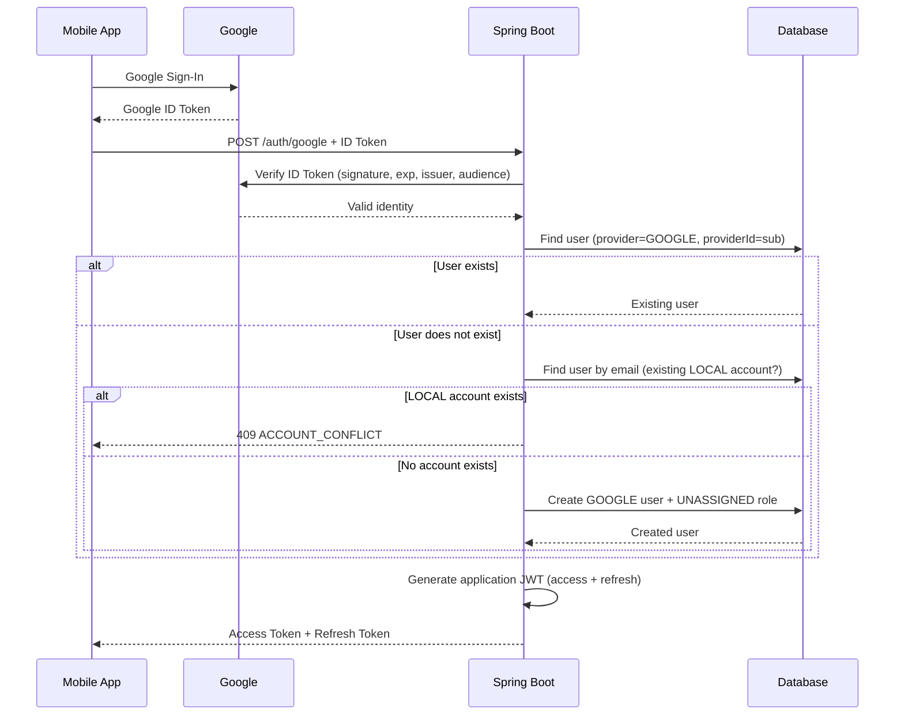

# Google Sign-In

## Overview

This feature adds **"Sign in with Google"** to the FitLink backend.

The mobile app (Android / iOS) performs Google Sign-In using the platform SDKs and
obtains a **Google ID Token**. It sends that token to the backend via
`POST /auth/google`. The backend **cryptographically verifies** the ID token with
Google's official Java library (`GoogleIdTokenVerifier`), finds or creates the
matching user, and then issues the application's **existing** JWT access token and
refresh token.

The Google ID Token is used **only once** to prove the user's Google identity. After
that, every subsequent API request uses the application's own JWT — exactly like a
normal email/password login.

## Architecture

```
Mobile App
   |
   | Google Sign-In
   v
Google
   |
   | Google ID Token
   v
Mobile App
   |
   | POST /auth/google  { "idToken": "..." }
   v
Spring Boot (googleAuthService)
   |
   | GoogleTokenVerifier.verifyAndExtractPayload(...)   ← cryptographically verified
   v
Verified Google identity  (sub, email, email_verified, name)
   |
   v
UserRepository
   |  1) findByProviderAndProviderId(GOOGLE, sub)  → existing user?
   |  2) otherwise findByEmail(...)                → existing local account? → conflict
   |  3) otherwise create new GOOGLE user (+ UNASSIGNED role)
   v
Existing jwtService  → generateAccessToken() + generateRefreshToken()
   |
   v
Mobile App  (uses our JWT from now on)
```

## Authentication Flow

1. The mobile client runs Google Sign-In and receives a **Google ID Token**.
2. The client calls `POST /auth/google` with the token in the body.
3. The backend verifies the token's **signature**, **expiration**, **issuer** and
   **audience** using Google's public keys (cached by `GoogleIdTokenVerifier`).
4. If verification fails the request is rejected with `401 GOOGLE_AUTH_FAILED`.
5. If the configured policy requires it (`google.require-verified-email=true`, the
   default), the Google `email_verified` claim must be `true`, otherwise the request
   is rejected with `403 EMAIL_NOT_VERIFIED`.
6. The backend looks up a user by `provider = GOOGLE` and `providerId = sub`:
   - **Found** → the existing user is logged in.
   - **Not found** → the backend checks whether an account already exists for the
     Google email:
     - A **local** account already exists → **do not** convert it. Reject with
       `409 ACCOUNT_CONFLICT` and tell the client to sign in with email/password.
     - No account exists → a new user is created with:
       `email`, `name` (from Google), `provider = GOOGLE`, `providerId = sub`,
       `emailVerified` taken from Google, status `ACTIVE`, the standard `UNASSIGNED`
       default role, and a random unguessable placeholder password hash.
7. The backend generates the application's access + refresh tokens with the existing
   `jwtService` and returns them in the same response shape as a normal login.

## Token Types

| Token | Issuer | Purpose | Lifetime |
|-------|--------|---------|----------|
| **Google ID Token** | Google | Proves the user's Google identity. Sent to the backend **once** on `/auth/google`. Never stored, never used as an API token. | ~1 hour (per Google) |
| **Application Access Token (JWT)** | FitLink backend | Authenticates every API request (`Authorization: Bearer <token>`). | 1 hour (`JWT_ACCESS_TOKEN_EXPIRATION`) |
| **Refresh Token** | FitLink backend | Obtains a new access token via `POST /auth/refresh-token`. | 30 days (`JWT_REFRESH_TOKEN_EXPIRATION`) |

The Google ID Token **must not** be reused as the application's API token: it was
issued for Google's audience, not for FitLink, and the mobile client cannot rely on
the backend to treat it as a session.

## Google Cloud Configuration

Create a Google Cloud project and configure three OAuth clients:

- **Android OAuth Client** — `SHA-1` fingerprint of the app's signing certificate +
  package name. Used by Google Sign-In inside the Android app.
- **iOS OAuth Client** — bundle identifier. Used by Google Sign-In inside the iOS app.
- **Web OAuth Client** — used as the **backend audience**.

> The backend verifies the ID token's `aud` claim against the **Web Client ID**.
> This is the standard pattern: ID tokens minted by the Android/iOS clients are
> issued to the *backend's* audience when the backend is the relying party, so the
> Web Client ID is the single ID the backend must accept.

**Why the Web Client ID (and not the Android/iOS IDs)?**
Because `GoogleIdTokenVerifier` validates one fixed audience. The Web Client ID is
the agreed "backend audience"; all mobile clients are configured to request an ID
token for it. It is **not a secret** — it can be embedded in the mobile app.

**Where `GOOGLE_CLIENT_ID` is configured:** in the environment / `.env` file
(see [Configuration](#configuration)). It must match the Web Client ID string
exactly, e.g. `123456789012-xxxxxxxxxxxxxxxxxxxxxxxxxxxxxxxx.apps.googleusercontent.com`.

> Do **not** put a Google Client Secret anywhere in the mobile app, and do **not**
> configure one for this backend flow — ID-token verification needs no secret.

## Backend Endpoint

### `POST /auth/google`

Request body (`GoogleLoginRequest`):

```json
{
  "idToken": "GOOGLE_ID_TOKEN"
}
```

`idToken` is required (`@NotBlank`); an empty or missing value is rejected with
`400 VALIDATION_ERROR`.

Success response (`200 OK`) — same contract as `POST /auth/login`:

```json
{
  "message": "Google login successful",
  "userName": "John Doe",
  "role": "ROLE_UNASSIGNED",
  "accessToken": "eyJhbGciOiJIUzI1NiJ9....",
  "refreshToken": "eyJhbGciOiJIUzI1NiJ9...."
}
```

New users receive `ROLE_UNASSIGNED` and then complete the normal
`PATCH /auth/select-role` flow to pick TRAINEE / COACH / GYM.

## User Account Logic

- **Existing Google user** — found by `(provider = GOOGLE, providerId = sub)`.
  They are logged straight in; nothing is recreated.
- **New Google user** — created with:
  - `email` = Google email
  - `userName` = Google `name` (falls back to the email local-part)
  - `emailVerified` = Google `email_verified`
  - `status` = `ACTIVE`
  - `provider` = `GOOGLE`
  - `providerId` = Google `sub`
  - `passwordHash` = random unguessable BCrypt placeholder (column is `NOT NULL`;
    the value can never match a real password)
  - default role = `UNASSIGNED` (same as a normal registration)
- **Existing LOCAL account with the same email** — rejected with `409
  ACCOUNT_CONFLICT`. The account is **never silently converted** to a Google account;
  the client is told to sign in with email + password instead.

**Identity keying:** Google's `sub` is the stable unique identifier of the Google
account (never the email, which can change). A composite unique constraint on
`(provider, provider_id)` prevents duplicate Google accounts.

**Existing rows:** the `provider` column is nullable — legacy local users have
`NULL` provider, which the code treats as `LOCAL`. Local authentication behaviour is
unchanged.

## Security

The backend **never trusts** the ID token payload, the email, name, picture or `sub`
directly from the mobile client. The mobile client only ever sends the opaque ID
token; all identity data is extracted from the **verified** token payload.

`GoogleTokenVerifier` enforces at minimum:

- **Signature** — RSA-256, validated against Google's cached public keys.
- **Expiration** — rejects expired tokens (with 5-minute clock-skew allowance).
- **Issuer** — `https://accounts.google.com`.
- **Audience** — must equal `GOOGLE_CLIENT_ID`.

Why the backend verifies at all: an attacker can mint or capture a token and send it
straight to `/auth/google`. Without signature/audience/expiry verification they could
impersonate any email. Verification binds the identity to Google.

Why the Client Secret must never live in the mobile app: the APK/IPA can be unpacked,
so any secret inside is publicly readable. The ID-token flow intentionally requires
no secret on the client or the backend.

The application stays **stateless**: no HTTP sessions, no `oauth2Login()`, no second
JWT implementation. The Google ID token is never stored as the user's auth token.

## Configuration

Environment variables (no secrets are hardcoded or committed):

| Variable | Required | Description |
|----------|----------|-------------|
| `GOOGLE_CLIENT_ID` | Yes | Web OAuth 2.0 Client ID used as the token audience. |
| `GOOGLE_REQUIRE_VERIFIED_EMAIL` | No (default `true`) | Reject Google accounts whose email is not verified by Google. |

`src/main/resources/application.properties`:

```properties
google.client-id=${GOOGLE_CLIENT_ID}
google.require-verified-email=${GOOGLE_REQUIRE_VERIFIED_EMAIL:true}
```

Add `GOOGLE_CLIENT_ID` to your environment (and to `.env` / `.env.example`). The
value is not a secret and may be shared with the mobile team.

## Error Handling

Errors are returned through the existing `AppException` / `ErrorCode` /
`GlobalExceptionHandler` pipeline as a single `ErrorResponse` body:

| Case | HTTP | Code |
|------|------|------|
| Missing / empty `idToken` | 400 | `VALIDATION_ERROR` |
| Malformed / bad-signature token | 401 | `GOOGLE_AUTH_FAILED` |
| Expired token | 401 | `GOOGLE_AUTH_FAILED` |
| Wrong audience / issuer | 401 | `GOOGLE_AUTH_FAILED` |
| Missing required identity data (`sub`/`email`) | 401 | `GOOGLE_AUTH_FAILED` |
| Google email not verified (policy) | 403 | `EMAIL_NOT_VERIFIED` |
| Existing LOCAL account with same email | 409 | `ACCOUNT_CONFLICT` |
| Duplicate `(provider, provider_id)` race | 409 | `DATA_INTEGRITY_VIOLATION` |

Example error body:

```json
{
  "timestamp": "2026-08-11T21:00:00",
  "status": 401,
  "code": "GOOGLE_AUTH_FAILED",
  "message": "Invalid or expired Google ID token",
  "path": "/auth/google"
}
```

## Mobile Integration Contract

Android and iOS developers:

1. **Perform Google Sign-In** with the platform SDK
   (`GoogleSignIn` on Android, `GoogleSignIn` / GIDSignIn on iOS).
2. **Obtain the Google ID Token** and pass the **backend's Web Client ID**
   (`GOOGLE_CLIENT_ID`) as the requested audience when configuring Sign-In.
3. **Send it once** to the backend:

   ```http
   POST /auth/google
   Content-Type: application/json

   { "idToken": "<GOOGLE_ID_TOKEN>" }
   ```

4. **Receive the application tokens** from the response (`accessToken`,
   `refreshToken`). Store them securely in the app's secure key store.
5. **Use `accessToken` for all subsequent calls**:

   ```http
   GET /api/...
   Authorization: Bearer <accessToken>
   ```

6. When the access token expires (HTTP 401), call `POST /auth/refresh-token` with the
   refresh token to get a new access token. If that fails, sign the user in again
   (Google or email/password).

## Sequence Diagram


